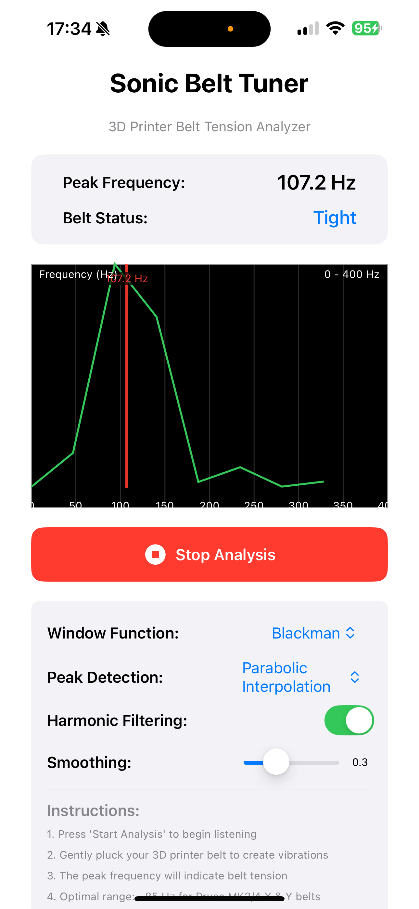

# Sonic Belt Tuner

An iOS application for measuring 3D printer belt tension using acoustic frequency analysis. Simply pluck your printer's belt and let SonicBeltTuner detect the resonant frequency to determine if your belts are properly tensioned.




## Features

### 🎯 Accurate Frequency Detection
- **Real-time FFT analysis** with 1024-point resolution
- **Multiple peak detection algorithms**:
  - Simple Peak Detection
  - Parabolic Interpolation (sub-Hz accuracy)
  - Spectral Centroid
- **Harmonic filtering** to isolate fundamental frequency
- **RMS averaging** for noise reduction

### 🎨 Professional Audio Processing
- **Selectable window functions**:
  - Blackman (default) - Best for reducing spectral leakage
  - Hanning
  - Hamming
  - None (rectangular)
- **Temporal smoothing** with adjustable factor (0.1-0.9)
- **Frequency range**: 0-400Hz optimized for belt analysis

### 📊 Visual Feedback
- **Real-time frequency spectrum** display
- **Peak frequency marker** with exact value
- **Belt tension status** indicator:
  - Very Loose: < 50 Hz
  - Loose: 50-82 Hz
  - **Good: 82-88 Hz** (Optimal for Prusa MK3/4)
  - Tight: 88-150 Hz
  - Very Tight: > 150 Hz

### 📱 iOS Optimized
- Native SwiftUI interface
- Safe area support for all iPhone models (notch, Dynamic Island)
- Microphone permission handling
- iOS 18.5+ support

## Installation

### Requirements
- Xcode 15.0 or later
- iOS 18.5+ deployment target
- Physical iPhone device (audio features limited in simulator)

### Build Instructions

1. Clone the repository:
```bash
git clone https://github.com/yourusername/SonicBeltTuner.git
cd SonicBeltTuner
```

2. Open in Xcode:
```bash
open SonicBeltTuner.xcodeproj
```

3. Select your development team in project settings

4. Build and run on your iPhone

## Usage

1. **Launch the app** on your iPhone
2. **Grant microphone permission** when prompted
3. **Press "Start Analysis"** to begin listening
4. **Pluck your 3D printer belt** like a guitar string
5. **Read the peak frequency** - aim for ~85 Hz for optimal tension
6. **Adjust belt tension** and re-test until in the "Good" range

### Pro Tips
- Pluck the belt in the middle of its span
- Ensure the printer is off and quiet
- Use **Harmonic Filtering** to isolate the fundamental frequency
- Adjust **Smoothing** for more stable readings

## Technical Details

### Signal Processing Pipeline
1. Audio capture at device's native sample rate
2. 512-sample buffer accumulation
3. Window function application (Blackman default)
4. 1024-point FFT computation
5. RMS averaging across 10 frames
6. Harmonic suppression (2x-6x harmonics)
7. Peak detection with sub-bin interpolation
8. Temporal smoothing

### Audio Specifications
- **Sample Rate**: Device native (typically 48 kHz)
- **FFT Size**: 1024 samples
- **Frequency Resolution**: ~43 Hz bins
- **Analysis Range**: 0-400 Hz
- **Buffer Size**: 512 samples

## Belt Tension Guidelines

### Prusa MK3/MK4 Series
- **X & Y Belts**: 82-88 Hz (optimal ~85 Hz)
- Test with printer off
- Pluck belt at midpoint
- Both belts should have similar tension

### General Guidelines
- Lower frequency = looser belt
- Higher frequency = tighter belt
- Consistent readings indicate good belt condition
- Fluctuating readings may indicate belt damage

## Contributing

Contributions are welcome! Please feel free to submit a Pull Request.

## License

This project is licensed under the MIT License - see the [LICENSE.md](LICENSE.md) file for details.

## Acknowledgments

- Built with Swift and SwiftUI
- Uses iOS Accelerate framework for FFT processing
- Inspired by the 3D printing community's need for precise belt tensioning

## Support

For issues, questions, or suggestions, please open an issue on GitHub.
